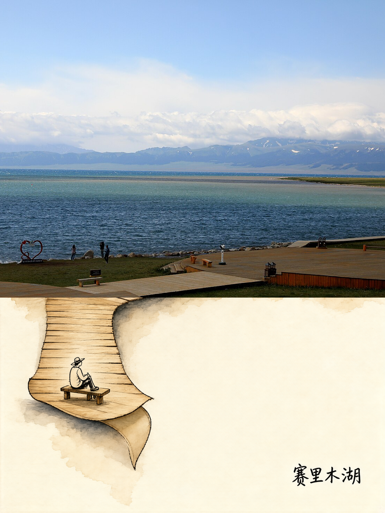

# Travel in the Second World

**让一张旅行照片，继续走进纸上的第二世界。**

这是一份通用型 Agent Skill：从实拍中的道路、水面、阶梯等真实结构出发，延伸出温暖纸感的小世界，再安排一个轻巧的互动。每张照片独立设计，成品统一为 **3:4 竖幅**，通常约 **60% 原照、40% 纸上世界**，搭配地点相关的中文小字。

**v1.1.0 已提供通用设计流程；当前 v1.1.1 整理了通用入口和使用说明。** 适用于具备图像生成／编辑能力的 Agent，不绑定 GPT、Agent 平台、模型厂商或某种订阅。使用你已经拥有的绘图工具即可；支持参考图和局部编辑的工具更适合保留原照。



[查看原片与来源](examples/sayram/ATTRIBUTION.md) · [下载当前版本](https://github.com/NMTZ-z/travel-in-the-second-world/releases/latest)

## 我该怎么用？

把下面这段话复制给你的 Agent，再上传照片并告诉它地点、喜欢的文案和修改要求。Agent 会读取规范、选择它能用的工具，然后开始设计。你不需要先学命令行或购买指定模型。

```text
请使用 Travel in the Second World：
https://github.com/NMTZ-z/travel-in-the-second-world
先阅读 README.md 和 skills/create-second-world-posters/SKILL.md；宿主支持 Skill 时按其规范加载，不支持时将这些文件作为工作指南。优先使用你已有的图像生成／编辑工具，不绑定特定厂商或模型，也不要把可选测试接口的 Key 当作前置条件。确认能读取原片、查看结果；仅在需要附带本地合成或动画脚本时准备隔离运行环境。
我会上传旅行照片，并提供地点、文案及修改要求。每张独立设计成 3:4 竖幅：通常约 60% 原照、40% 象牙色纸上世界，从原图真实结构准确接续，只做一种转化和一个互动，保留关键主体与清晰度，角落文字优先中文。逐项检查融合、支撑与文字；不能把生成式重绘说成无损保留。
有可用视频工具或文件执行能力时，再制作恰好 3 秒、动作连续且只在合理区域发生的局部动画，交付最终 PNG 和 MP4；没有视频能力则完成静态图并说明限制，不用静止视频充数。先读取规范并说明你当前可执行的路线，然后按我上传的照片开始。
```

也可单独打开 [Agent 启动说明](AGENT_START.md) 复制。能够安装 Skill 的宿主可加载 [核心目录](skills/create-second-world-posters) 或 Release 中的独立 Skill ZIP；具体安装入口由宿主决定。不能安装 Skill、但能够读取这些文件的 Agent，也可在当前任务中遵循同一流程。

## 能得到什么？

| Agent 当前能力 | 可完成的工作 |
| --- | --- |
| 能读取照片、调用图像生成／编辑工具并查看结果 | 独立的第二世界静态海报 |
| 另有文件合成或可靠局部编辑能力 | 更精确地复用原片、控制裁切和保护区域 |
| 另有文件执行能力或已接通的视频工具 | 制作并检查恰好 3 秒的局部动态素材 |

默认交付一张 PNG 与一个 3 秒 MP4；只做静态图、或 Agent 没有视频能力时交付 PNG。MP4 可供你后续转换 Live Photo，本项目不直接生成原生 Live Photo。

Skill 提供的是设计、编辑和验收方法，实际出图由 Agent 使用的模型完成。不同工具对局部编辑和原片保留的支持不同；仅能文生图的工具无法保证准确保留原照片。每张成品都要检查结构衔接、人物支撑和中文，不保证一次生成就通过。

## 动态与可选本地工具

附带工具可制作经过验证的二维局部水纹动画：水动，岸线、树林、人物与文字保持稳定。需要先圈选水面和保护区；复杂人物动作、弯河或多向流可能不适合。当前没有统一接入视频生成模型。

这些脚本是可选辅助，**不影响使用 Agent 自带绘图工具完成静态海报**。想在本地运行预览、离线圈选与三秒示例，可按 [本地工具说明](docs/LOCAL_TOOLS.md) 操作。具体服务接口只放在可选适配器参考中，通用流程不要求任何指定接口凭据。

## 设计原则与公开验证

先让原图结构准确连接，再改变物理规则；每张只做一个互动，大面积留白，不靠模糊掩盖接缝。默认保留原照片的主体、关系与色彩；用户允许后才调整氛围。缩放裁切或生成式重绘不称为无损保留。

完整工作规则见 [SKILL.md](skills/create-second-world-posters/SKILL.md)，实际测试范围与限制见 [验证记录](docs/VALIDATION.md)。示例使用公开授权照片，未公开用户私有旅行照片。

代码与文档采用 [Apache-2.0](LICENSE)；示例原片的授权见 [来源说明](examples/sayram/ATTRIBUTION.md)。
